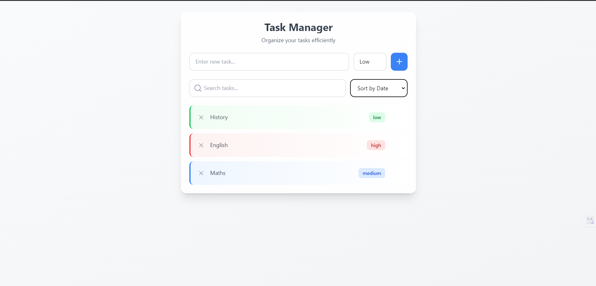

# Task Manager React Application

A modern, responsive task management application built with React, featuring an intuitive user interface for managing daily tasks with priority levels, search functionality, and multiple sorting options.


*Initial view of the Task Manager*


*Task Manager with several tasks added*

## Features

- 📝 Create tasks with priority levels (High, Medium, Low)
- 🔍 Search functionality to filter tasks
- 🔄 Multiple sorting options (Date, Title, Priority, Status)
- ✅ Mark tasks as complete/incomplete
- 🗑️ Delete tasks
- 💾 Persistent storage using localStorage
- 📱 Fully responsive design
- 🎨 Visual priority indicators
- ⚡ Real-time updates
- 🔔 Success notifications

## Live Demo

[Add your deployment URL here]

## Setup and Installation

1. Clone the repository:
```bash
git clone [your-repository-url]
cd task-manager
```

2. Install dependencies:
```bash
npm install
# or
yarn install
```

3. Install required packages:
```bash
npm install lucide-react
# or
yarn add lucide-react
```

4. Start the development server:
```bash
npm run dev
# or
yarn dev
```

5. Open your browser and navigate to:
```
http://localhost:3000
```

## Usage

1. **Adding a Task**
   - Type your task in the input field
   - Select priority level (Low, Medium, High)
   - Press Enter or click the '+' button

2. **Managing Tasks**
   - Click the check/x icon to toggle task completion
   - Hover over a task to reveal the delete button
   - Click the delete (trash) icon to remove a task

3. **Searching and Sorting**
   - Use the search bar to filter tasks
   - Use the sort dropdown to organize tasks by:
     - Date (newest first)
     - Title (alphabetical)
     - Priority (high to low)
     - Status (complete/incomplete)

## Technical Details

### Technologies Used

- React 18
- Tailwind CSS
- Lucide React Icons
- localStorage for data persistence

### Key Components

- `TaskManager`: Main component handling task management logic
- Custom notification system
- Responsive layout using Tailwind CSS
- Priority-based visual indicators

### State Management

- Uses React's useState for state management
- Persists data in localStorage
- Implements useEffect for side effects

## Development Assumptions

1. **Browser Support**
   - Modern browsers with localStorage support
   - JavaScript enabled
   - CSS Grid and Flexbox support

2. **Data Persistence**
   - Uses browser's localStorage
   - No backend database required
   - Data persists across page refreshes

3. **User Interface**
   - Minimum screen width of 320px (mobile-first design)
   - Touch-friendly interface for mobile devices
   - Supports both mouse and touch interactions

4. **Performance**
   - Assumes reasonable number of tasks (< 1000)
   - Client-side filtering and sorting
   - No pagination implemented

## Future Improvements

- [ ] Add task categories/tags
- [ ] Implement due dates
- [ ] Add data export functionality
- [ ] Implement drag-and-drop reordering
- [ ] Add task notes/descriptions
- [ ] Implement user authentication
- [ ] Add dark mode support

## Contributing

1. Fork the repository
2. Create your feature branch (`git checkout -b feature/AmazingFeature`)
3. Commit your changes (`git commit -m 'Add some AmazingFeature'`)
4. Push to the branch (`git push origin feature/AmazingFeature`)
5. Open a Pull Request


## Acknowledgments

- Icons provided by [Lucide Icons](https://lucide.dev/)
- Styling framework: [Tailwind CSS](https://tailwindcss.com/)

## Screenshots


### Desktop View

*Full desktop view with multiple tasks*

### Mobile View

*Responsive mobile view*

### Task Management

*Task interaction options including complete, delete, and priority indicators*

